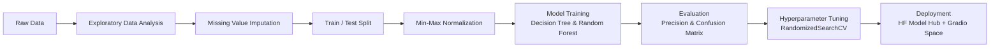

# **💧 Water Potability Prediction**
This project aims to predict whether a water sample is potable based on its physicochemical properties, using classical machine learning methods (Decision Tree and Random Forest).

[](https://www.python.org/)
[](https://scikit-learn.org/)
[](LICENSE)
[](https://huggingface.co/spaces/KubraParmak/water-potability-demo)
[](https://huggingface.co/KubraParmak/water-potability-model)

🇹🇷 [Türkçe](README.tr.md) | 🇬🇧 English

---

## **📌 Overview**
Access to safe drinking water is a basic human need, yet water quality testing is not always fast or available everywhere. This project explores whether **simple, interpretable machine learning models** can predict water potability directly from measurable physicochemical features — without relying on a full laboratory water-quality test.

The pipeline covers the full data science workflow: exploratory data analysis, missing-value handling, feature scaling, model training, evaluation, and hyperparameter tuning, with the final model deployed as a live interactive demo. 

**🔗 Live demo:** [Hugging Face Space](https://huggingface.co/spaces/KubraParmak/water-potability-demo)
**📦 Trained model:** [Hugging Face Model Hub](https://huggingface.co/KubraParmak/water-potability-model)

---

## **🗂️ Dataset**

- **Source:** [Water Potability Dataset](https://www.kaggle.com/datasets/adityakadiwal/water-potability) (Kaggle, by Aditya Kadiwal)
- **Samples:** 3,276 water samples
- **Target:** `Potability` — binary (`0` = Not Potable, `1` = Potable)
- **Class balance:** 1,998 not potable (61%) vs. 1,278 potable (39%)


| Feature | Description |
|---|---|
| `ph` | pH of water (0–14) |
| `Hardness` | Capacity of water to precipitate soap, in mg/L |
| `Solids` | Total dissolved solids, in ppm |
| `Chloramines` | Amount of chloramines, in ppm |
| `Sulfate` | Amount of sulfates dissolved, in mg/L |
| `Conductivity` | Electrical conductivity of water, in μS/cm |
| `Organic_carbon` | Amount of organic carbon, in ppm |
| `Trihalomethanes` | Amount of trihalomethanes, in μg/L |
| `Turbidity` | Measure of light-emitting property of water, in NTU |

---

## **🔄 Project Workflow**



### 1. Exploratory Data Analysis (EDA)

- Inspected dataset structure, summary statistics, and target variable distribution (pie chart of potable vs. non-potable samples).
- Visualized feature correlations with a clustered heatmap.
- Compared feature distributions between potable and non-potable samples using KDE plots.
- Used `missingno` to visualize the pattern of missing data.


### 2. Missing Value Handling

Three features contained missing values:
 
| Feature | Missing Count | Missing % |
|---|---|---|
| `ph` | 491 | 15.0% |
| `Sulfate` | 781 | 23.8% |
| `Trihalomethanes` | 162 | 4.9% |
 
Since all three features approximated a **Gaussian distribution**, missing values were imputed using the **mean grouped by the target class (`Potability`)**, preserving the underlying distribution shape better than a single global mean.


### 3. Train/Test Split & Normalization

- Split: 70% train / 30% test (`train_test_split`, `random_state=42`) → 2,293 train samples, 983 test samples.
- **Min-Max normalization** was applied, fit on the training set only and reused on the test set to avoid data leakage.


### 4. Modeling

Two classifiers were trained and compared:
 
| Model | Configuration |
|---|---|
| Decision Tree | `max_depth=5`, `random_state=42` |
| Random Forest | `class_weight='balanced'`, `random_state=42` |


### 5. Evaluation
 
Models were evaluated using **precision** (prioritized to minimize false positives — i.e., minimizing the risk of labeling unsafe water as potable) and confusion matrices.
 
| Model | Precision (Test Set) |
|---|---|
| Decision Tree | 0.7302 |
| **Random Forest** | **0.8095** |
 
The Decision Tree was also visualized with `sklearn.tree.plot_tree` for interpretability.


 ### 6. Hyperparameter Tuning
 
`RandomizedSearchCV` (10 iterations) with `RepeatedStratifiedKFold` (5 splits × 2 repeats) was used to tune the Random Forest:
 
```python
param_grid = {
    "n_estimators": [10, 50, 100],
    "max_features": ["sqrt", "log2"],
    "max_depth": list(range(1, 21, 3)),
}
```
 
**Best parameters found:** `n_estimators=50`, `max_features='log2'`, `max_depth=13` → cross-validated accuracy of **0.7946**.


### 7. Deployment

The final models were serialized with `joblib` and deployed to the **Hugging Face Hub**:
- A **Model repository** hosting the trained artifacts and the original notebook.
- A **Gradio Space** providing an interactive UI where users can input water sample measurements and get an instant potability prediction.

---

## **🛠️ Tech Stack**
 
- **Data analysis & visualization:** `pandas`, `numpy`, `seaborn`, `matplotlib`, `plotly`, `missingno`
- **Machine learning:** `scikit-learn` (`DecisionTreeClassifier`, `RandomForestClassifier`, `RandomizedSearchCV`, `RepeatedStratifiedKFold`)
- **Model persistence:** `joblib`
- **Deployment:** `gradio`, `huggingface_hub`
  
---

## **📁 Repository Structure**
 
```
water-quality-potability/
├── water-quality.ipynb          # Full notebook: EDA, preprocessing, modeling, tuning
├── water_quality_artifact.joblib # Serialized models + scaling parameters
├── app.py                        # Gradio demo app (same one powering the HF Space)
├── requirements.txt
├── README.md
├── README.tr.md
└── LICENSE
```
 
---

## **🚀 Getting Started**

### Installation

```bash
git clone https://github.com/KubraParmak/water-quality-potability.git
cd water-quality-potability
pip install -r requirements.txt
```

### Run the notebook

```bash
jupyter notebook water-quality.ipynb
```
 
### Use the trained model directly

```python
import joblib
import numpy as np
 
artifact = joblib.load("water_quality_artifact.joblib")
model = artifact["models"]["RF"]
x_min, x_max = artifact["x_min"], artifact["x_max"]
 
sample = np.array([[7.0, 200.0, 20000.0, 7.0, 330.0, 420.0, 14.0, 66.0, 4.0]])
scaled = (sample - x_min) / (x_max - x_min)
print("Potable" if model.predict(scaled)[0] == 1 else "Not potable")
```
 
Or just try the [**live demo**](https://huggingface.co/spaces/KubraParmak/water-potability-demo) — no installation required.


### Run the demo locally

```bash
python app.py
```
This launches the same Gradio interface used in the Hugging Face Space, served locally at `http://127.0.0.1:7860`.

---

## **🔮 Future Improvements**
 
- Use cross-validated precision/recall/F1 instead of a single train/test split for more robust evaluation.
- Try gradient boosting models (XGBoost, LightGBM) for comparison.
- Add SHAP-based feature importance analysis for interpretability.

---

## **📄 License**
 
This project is licensed under the [MIT License](LICENSE).


## **🙋 Author**
 
**Kübra Parmak**
- GitHub: [@KbrPrmk](https://github.com/KbrPrmk)
- Hugging Face: [@KubraParmak](https://huggingface.co/KubraParmak)


## **🙏 Acknowledgments**
 
- Dataset by [Aditya Kadiwal on Kaggle](https://www.kaggle.com/datasets/adityakadiwal/water-potability).
