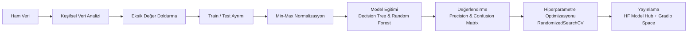

<h1 align="center">💧 Su İçilebilirlik Tahmini</h1>
<p align="center"><b>Suyun fiziksel/kimyasal özelliklerine bakarak içilebilir olup olmadığını tahmin eden, klasik makine öğrenmesi (Decision Tree & Random Forest) tabanlı bir proje.</b></p>
<p align="center">
    
    
    
    
    
</p>

🇹🇷 Türkçe | 🇬🇧 [English](README.md)

---

## **📌 Genel Bakış**
 
Güvenli içme suyuna erişim temel bir insan ihtiyacı, ama su kalitesi testleri her zaman hızlı ya da her yerde erişilebilir değil. Bu proje, **basit ve yorumlanabilir makine öğrenmesi modellerinin**, tam bir laboratuvar testine ihtiyaç duymadan, ölçülebilir fiziksel/kimyasal özelliklerden suyun içilebilirliğini tahmin edip edemeyeceğini araştırıyor.
 
Proje; keşifsel veri analizi, eksik veri işleme, özellik ölçeklendirme, model eğitimi, değerlendirme ve hiperparametre optimizasyonunu kapsayan tam bir veri bilimi sürecini içeriyor ve son model canlı, interaktif bir demo olarak yayınlandı.
 
**🔗 Canlı demo:** [Hugging Face Space](https://huggingface.co/spaces/KubraParmak/water-potability-demo)
**📦 Eğitilmiş model:** [Hugging Face Model Hub](https://huggingface.co/KubraParmak/water-potability-model)

---


## **🗂️ Veri Seti**
 
- **Kaynak:** [Water Potability Dataset](https://www.kaggle.com/datasets/adityakadiwal/water-potability) (Kaggle, Aditya Kadiwal)
- **Örnek sayısı:** 3.276 su örneği
- **Hedef değişken:** `Potability` — ikili (`0` = İçilemez, `1` = İçilebilir)
- **Sınıf dağılımı:** 1.998 içilemez (%61) vs. 1.278 içilebilir (%39)
| Özellik | Açıklama |
|---|---|
| `ph` | Suyun pH değeri (0–14) |
| `Hardness` | Suyun sabunu çökeltme kapasitesi (mg/L) |
| `Solids` | Toplam çözünmüş katı madde (ppm) |
| `Chloramines` | Kloramin miktarı (ppm) |
| `Sulfate` | Çözünmüş sülfat miktarı (mg/L) |
| `Conductivity` | Suyun elektriksel iletkenliği (μS/cm) |
| `Organic_carbon` | Organik karbon miktarı (ppm) |
| `Trihalomethanes` | Trihalometan miktarı (μg/L) |
| `Turbidity` | Suyun bulanıklık/ışık geçirgenlik ölçüsü (NTU) |

---

## **🔄 Proje Akışı**
 


### 1. Keşifsel Veri Analizi (EDA)

- Veri setinin yapısı, özet istatistikleri ve hedef değişkenin dağılımı incelendi (içilebilir/içilemez oranı için pasta grafiği).
- Özellikler arası korelasyonlar kümelenmiş bir ısı haritasıyla görselleştirildi.
- İçilebilir ve içilemez örnekler arasındaki özellik dağılımları KDE grafikleriyle karşılaştırıldı.
- Eksik veri deseni `missingno` kütüphanesiyle görselleştirildi.


### 2. Eksik Değer İşleme

Üç özellikte eksik değer bulunuyordu:
 
| Özellik | Eksik Sayısı | Eksik % |
|---|---|---|
| `ph` | 491 | %15,0 |
| `Sulfate` | 781 | %23,8 |
| `Trihalomethanes` | 162 | %4,9 |
 
Bu üç özellik de **Gauss dağılımına** yakın bir dağılım gösterdiğinden, eksik değerler **hedef sınıfa (`Potability`) göre gruplanmış ortalama** ile dolduruldu; bu yöntem, tek bir genel ortalama kullanmaktan daha iyi bir şekilde dağılımın şeklini korur.

 
### 3. Train/Test Ayrımı & Normalizasyon

- Ayrım: %70 train / %30 test (`train_test_split`, `random_state=42`) → 2.293 train örneği, 983 test örneği.
- **Min-Max normalizasyon** uygulandı; ölçekleme parametreleri sadece train setinden hesaplandı ve test setine de aynı şekilde uygulanarak veri sızıntısı (data leakage) önlendi.
### 4. Modelleme
İki sınıflandırıcı eğitildi ve karşılaştırıldı:
 
| Model | Konfigürasyon |
|---|---|
| Decision Tree | `max_depth=5`, `random_state=42` |
| Random Forest | `class_weight='balanced'`, `random_state=42` |

 
### 5. Değerlendirme
 
Modeller **precision** metriğiyle değerlendirildi (yanlış pozitifleri minimize etmek öncelikli — yani içilemez bir suyu içilebilir olarak etiketleme riskini azaltmak) ve confusion matrix ile desteklendi.
 
| Model | Precision (Test Seti) |
|---|---|
| Decision Tree | 0,7302 |
| **Random Forest** | **0,8095** |
 
Decision Tree modeli, yorumlanabilirlik için `sklearn.tree.plot_tree` ile görselleştirildi.

 
### 6. Hiperparametre Optimizasyonu

Random Forest'ı optimize etmek için `RandomizedSearchCV` (10 iterasyon) ve `RepeatedStratifiedKFold` (5 katlama × 2 tekrar) kullanıldı:
 
```python
param_grid = {
    "n_estimators": [10, 50, 100],
    "max_features": ["sqrt", "log2"],
    "max_depth": list(range(1, 21, 3)),
}
```
 
**Bulunan en iyi parametreler:** `n_estimators=50`, `max_features='log2'`, `max_depth=13` → çapraz doğrulamalı (cross-validated) doğruluk: **0,7946**.


 
### 7. Yayınlama (Deployment)

Son modeller `joblib` ile serileştirildi ve **Hugging Face Hub**'a yüklendi:
- Eğitilmiş model dosyalarını ve orijinal notebook'u barındıran bir **Model deposu**.
- Kullanıcıların su örneği değerlerini girip anında içilebilirlik tahmini alabildiği interaktif bir **Gradio Space**.

---

## **🛠️ Kullanılan Teknolojiler**
 
- **Veri analizi & görselleştirme:** `pandas`, `numpy`, `seaborn`, `matplotlib`, `plotly`, `missingno`
- **Makine öğrenmesi:** `scikit-learn` (`DecisionTreeClassifier`, `RandomForestClassifier`, `RandomizedSearchCV`, `RepeatedStratifiedKFold`)
- **Model kaydetme:** `joblib`
- **Yayınlama:** `gradio`, `huggingface_hub`

---

## **📁 Depo Yapısı**
 
```
water-quality-potability/
├── water-quality.ipynb          # Tüm notebook: EDA, ön işleme, modelleme, optimizasyon
├── water_quality_artifact.joblib # Serileştirilmiş modeller + ölçekleme parametreleri
├── app.py                        # Gradio demo uygulaması (HF Space'i çalıştıran aynı dosya)
├── requirements.txt
├── README.md
├── README.tr.md
└── LICENSE
```

---

## **🚀 Başlarken**

### Kurulum

```bash
git clone https://github.com/KubraParmak/water-quality-potability.git
cd water-quality-potability
pip install -r requirements.txt
```

 
### Notebook'u çalıştırma

```bash
jupyter notebook water-quality.ipynb
```

 
### Eğitilmiş modeli doğrudan kullanma

```python
import joblib
import numpy as np
 
artifact = joblib.load("water_quality_artifact.joblib")
model = artifact["models"]["RF"]
x_min, x_max = artifact["x_min"], artifact["x_max"]
 
sample = np.array([[7.0, 200.0, 20000.0, 7.0, 330.0, 420.0, 14.0, 66.0, 4.0]])
scaled = (sample - x_min) / (x_max - x_min)
print("İçilebilir" if model.predict(scaled)[0] == 1 else "İçilemez")
```
 
Ya da kurulum yapmadan doğrudan [**canlı demoyu**](https://huggingface.co/spaces/KubraParmak/water-potability-demo) deneyebilirsin.


### Demoyu yerelde çalıştırma

```bash
python app.py
```
Bu komut, Hugging Face Space'teki ile aynı Gradio arayüzünü `http://127.0.0.1:7860` adresinde yerel olarak başlatır.

---

# **🔮 Gelecek Geliştirmeler**
 
- Tek bir train/test ayrımı yerine çapraz doğrulamalı precision/recall/F1 skorları kullanmak, daha güvenilir bir değerlendirme sağlar.
- Karşılaştırma için gradient boosting modelleri (XGBoost, LightGBM) denenebilir.
- Yorumlanabilirlik için SHAP tabanlı özellik önem analizi eklenebilir.

---

## **📄 Lisans**
 
Bu proje [MIT Lisansı](LICENSE) ile lisanslanmıştır.

 
## **🙋 Geliştirici**
 
**Kübra Parmak**
- GitHub: [@KbrPrmk](https://github.com/KbrPrmk)
- Hugging Face: [@KubraParmak](https://huggingface.co/KubraParmak)


## **🙏 Teşekkürler**
 
- Veri seti: [Aditya Kadiwal, Kaggle](https://www.kaggle.com/datasets/adityakadiwal/water-potability).
